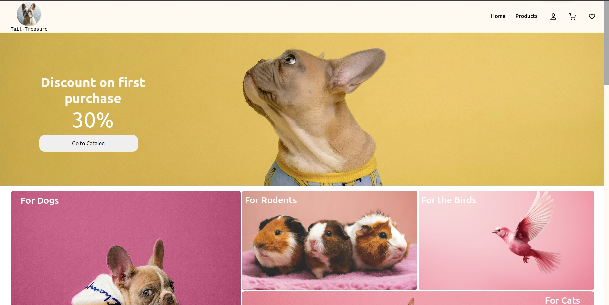
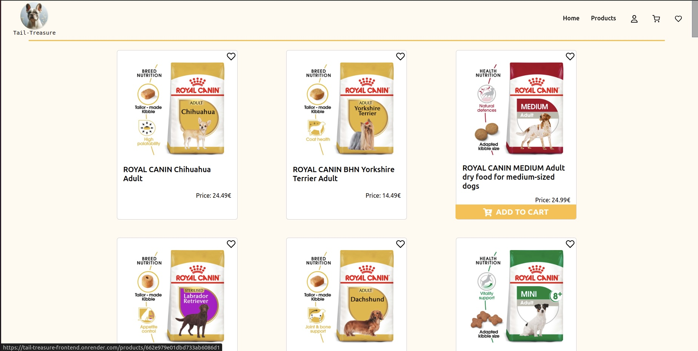
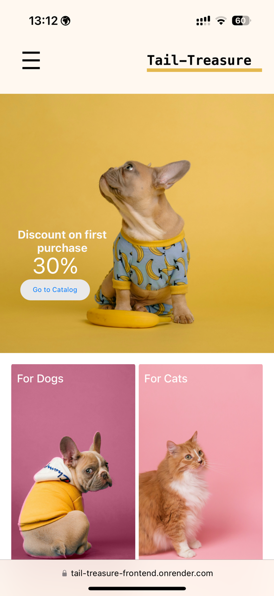
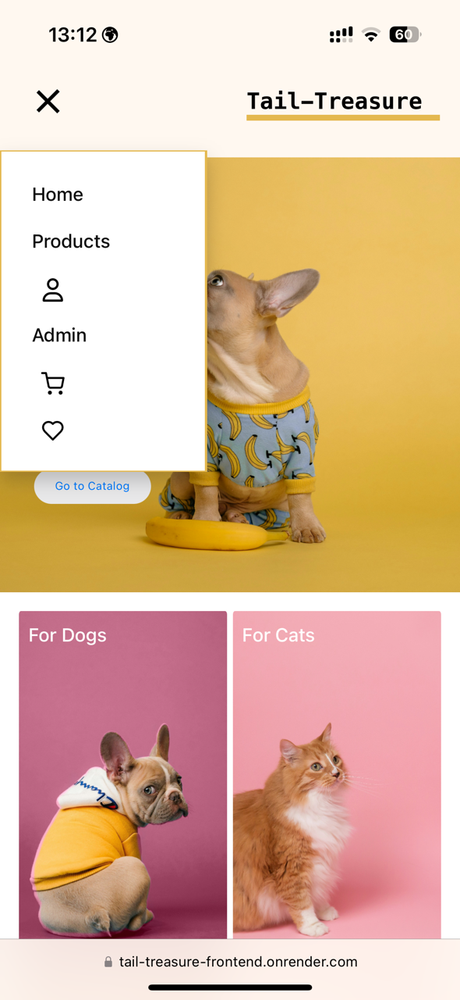
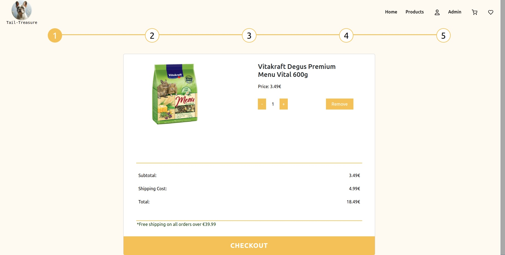
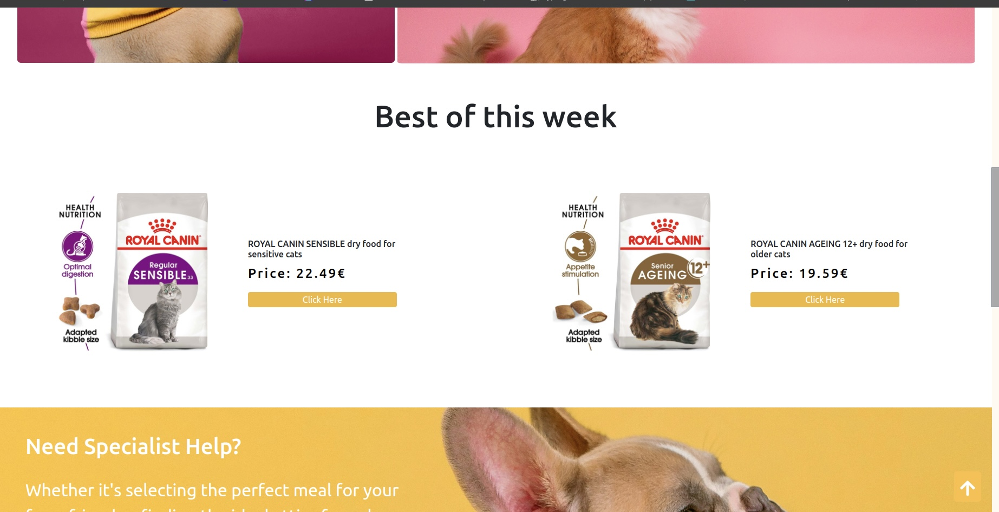
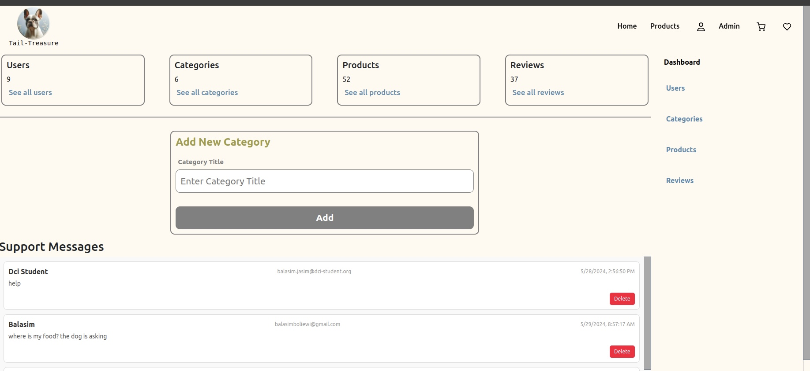

# Tail-Treasure Online Pet Food Shop

Tail-Treasure is an online pet food shop designed to provide a wide variety of pet foods and supplies with an easy-to-use interface. This project was developed in collaboration with a team.

## Team Members

- [VasylynaSidei](https://github.com/VasylynaSidei)
- [martinbacher](https://github.com/martinbacher)
- [kiriakosvaggel](https://github.com/kiriakosvaggel)
- [BalasimJasim](https://github.com/BalasimJasim)

## Technologies Used

- React
- Node.js
- Express
- MongoDB
- CSS/SCSS
- Tailwind CSS
- Bootstrap
- Cookies
- JWT (JSON Web Tokens)

## Features

- **Responsive Design**: Optimized for all device sizes.
- **User Authentication**: Register, login, logout, and profile management.
- **Forgot and Reset Password**: Secure password recovery and reset functionality.
- **Product Management**: Dynamic gallery for browsing products.
- **Shopping Cart**: Add to cart, view cart, and checkout process.
- **Admin Dashboard**: Manage products, orders, and users.
- **Contact Form**: Integrated with EmailJS for direct customer inquiries.

## Installation

To run this project locally, follow these steps:

1. Clone the repository:

   ```bash
   git clone git@github.com:BalasimJasim/Tail-Treasure.git
   cd tail-treasure
   ```

2. Install the dependencies:

   ```bash
   npm install
   ```

3. Set up the environment variables by creating a `.env` file in the root directory. Add the following variables:

   ```
   PORT=5000
   SECRET_KEY=your_secret_key
   CONNECTION_STRING=your_mongodb_connection_string
   EMAIL_APP=your_email_app
   APP_PASS=your_app_password
   CLIENT_DOMAIN=http://localhost:5173
   SERVER_DOMAIN=http://localhost:5000
   ```

4. **Run the backend server**:

   ```bash
   npm start
   ```

5. **Run the frontend server**:
   ```bash
   npm run dev
   ```

## Usage

Visit [Tail-Treasure](https://tail-treasure-frontend.onrender.com/) to view the application.

### Home Page



### Product Page



### Home Page (Mobile)





### Shopping Cart



### Featured Products Slider



### Admin Dashboard


